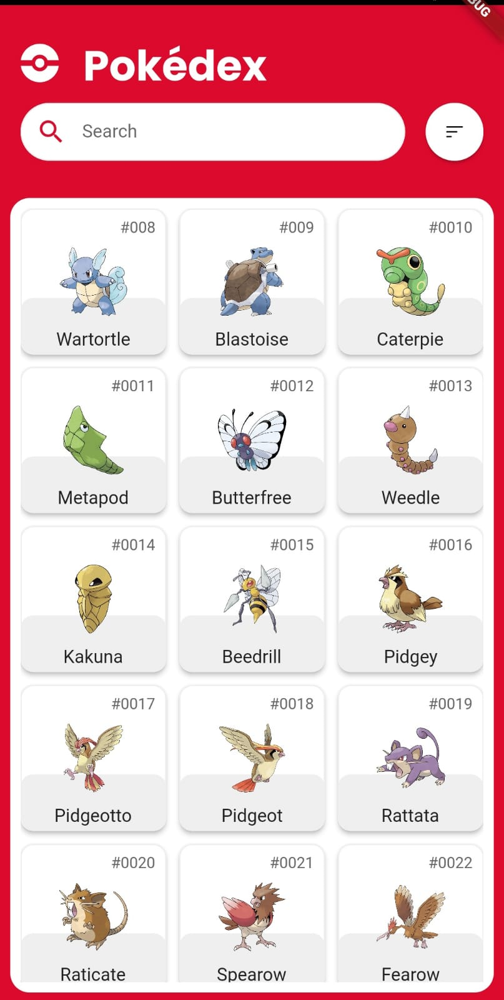
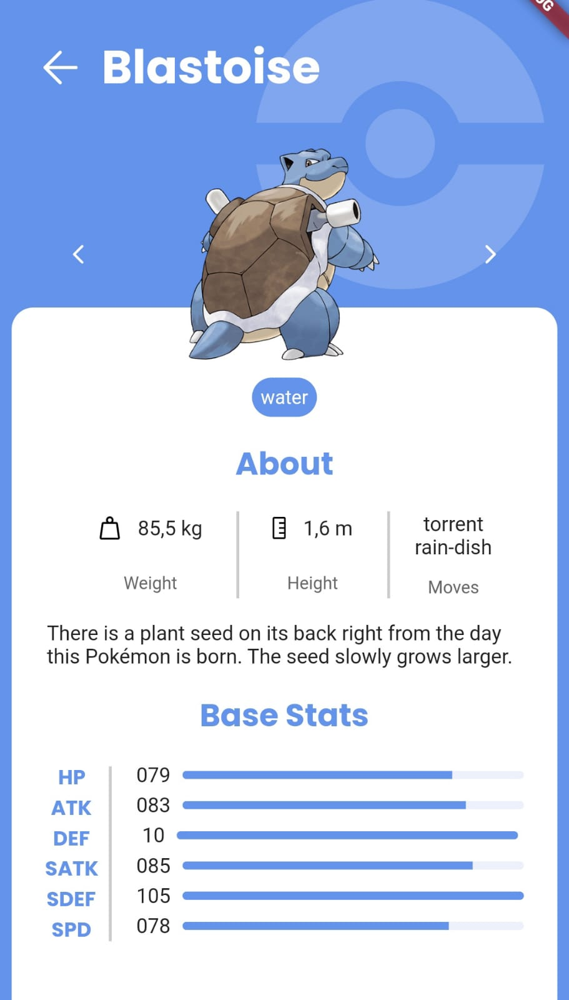

# Flutter Pokédex




## Estrutura do projeto

```
lib/
|___ app.dart               # Ponto central da aplicação Flutter, onde são feitas configurações de inicialização.
|___ main.dart              # Ponto de entrada da aplicação, onde a função main() fica.
|___ commons/               # Diretório que contém arquivos utilitários, configurações e classes genéricas que são reutilizadas em todo o aplicativo.
|   |___ config/            # Contém arquivos de configuração que controlam várias configurações da aplicação.
|   |___ erros/             # Contém classes para lidar com os diferentes tipos de erros que a aplicação pode encontrar.
|   |___ http_client/       # Contém a configuração para as solicitações HTTP feitas pela aplicação.
|   |___ pokedex_ui/        # Contém widgets, paleta de cores, extensions, blocs e enums reutilizáveis para implementar a UI do App.
|   |___ result_wrapper/    # Contém a implementação de um padrão de envoltório de resultado para tratar de operações que podem falhar ou ter sucesso.
|   |___ states/            # Contém a definição dos estados de UI que podem ser compartilhados entre vários widgets.
|   
|___ core/                  # Diretório que contém a lógica central da aplicação (ou seja, as regras de negócio).
|   |___ data/              # Contém as implementações de armazenamento de dados e redes da aplicação.
|   |   |___ datasouces/    # Encarregado de buscar dados de uma fonte externa, como uma API.
|   |   |___ models/        # Modelos de dados que são usados para transportar dados dentro da aplicação.
|   |   |___ repositories/  # Implementa a lógica de busca e armazenamento de dados.
|   |   
|   |___ domain/            # Contém a lógica de negócios central e as entidades da aplicação.
|       |___ use_cases/     # Encarregado de orquestrar a execução das regras de negócios.
|       |___ repositories/  # Interfaces que definem o que os repositórios de dados devem fazer.
|       |___ entities/      # Objetos simples que representam os dados que a aplicação trabalha.
|
|___ presentation/          # Contém a lógica de apresentação e os componentes de UI da aplicação.
    |___ pages/             # Contém os widgets de página que representam as diferentes telas da aplicação.
         
    

```

## Rodando o Projeto

Se houver mais de um dispositivo conectado.
``flutter run -d <deviceID>``

Se isso não for o caso.
```flutter run ```

## Rodando Testes unitários

Sem coverage
```flutter test test/```
com coverage
```flutter test --machine --coverage > tests.output```

## Rodando Testes de integração

Antes de tudo, identifique o dispositivo conectado.
``adb devices``

Depois copie o id do dispositivo <DEVICE_ID>.
Para rodar os testes da HomePage.

```flutter test integration_test/presentation/home_page/home_page.dart -d <DEVICE_ID>```

para rodar os testes da PageDetails

```flutter test integration_test/presentation/details_page/details_page.dart -d <DEVICE_ID>```